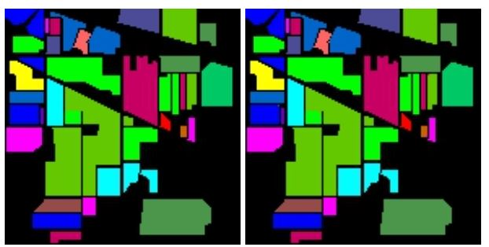
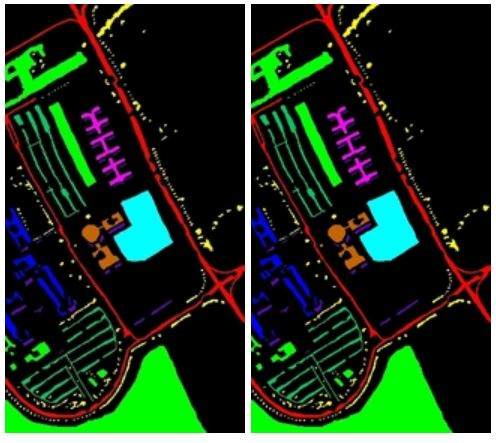

# MDA-HSI - Multi-Dimensional Deep Hierarchical Approach Towards Aerial Hyperspectral Image Classification

## Description 

This paper proposes MDA-HSI, a dual model integrated voting network for hyperspectral image classification. The first model employs a 3D-2D hierarchical structure to provide the spectral spatial joint features along with the abstract level spatial representation of 2D CNNs. The second model is a 3D CNN where the performance increase is provided by incorporating overlapping patches on the original hyperspectral cube to create feature maps over multiple contiguous bands.

## Datasets

This system has employed models, which use the three publicly available and highly popular hyperspectral imaging datasets - Indian pines (landscape in Indiana, a state in the United States, with agricultural and natural vegetation dominating the landcover distribution) , Salinas Valley(The scenery at this location is one of less agriculture and mere plants and bushes, vineyards and barren land) , University of Pavia ( was collected by the ROSIS sensor, in flight over the Pavia university and Pavia Centre, Italy).

Salinas data is of size 512×217×224 with a 3.7 meter spatial resolution with 512 × 217 is spatial and 224 spectral dimensions. It comprises of vineyard fields, vegetables and bare soils and has 16 categories .Indian Pines data in the wavelength range 0.4 − 2.5 × 10−6 is of size 145×145×224 meters where 224 spectral dimensions and 145 × 145 spatial dimensions are available. Indian Pines provides 16 non mutually exclusive classes. Pavia University Data consists of 103 spectral bands and 610 × 610 spatial dimensions with a 1.3 meter spatial resolution. 

## Prerequisites

- [Tensorflow](https://github.com/tensorflow/tensorflow)
- [Keras 2.0](https://github.com/fchollet/keras)
- [Spectral](https://github.com/spectralpython/spectral)
- [OpenCV-Python](https://github.com/opencv/opencv)

## Model Architecture

A hierarchical approach of 3D-2D is followed for the classification process. 2D CNNs use two dimensional kernels for input data convolutions. The full spatial dimension is covered by the kernel striding over. Gradient descent optimization is employed for parameter training of the CNN architecture (kernel weight and bias). The application of convolutions on the spatial layer alone is characteristic to HIS 2D CNNs and this property is utilized with a front 3D CNN architecture to arrive at a more abstract level representation of reduced dimensionality, which in turn reduces the high complexities involved with the spectral spatial joint representations provided by 3D CNNs. T

## Results

  

## Metrics

  
