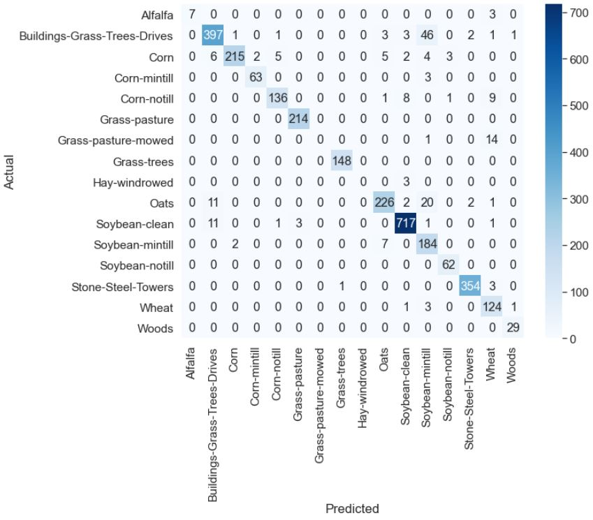
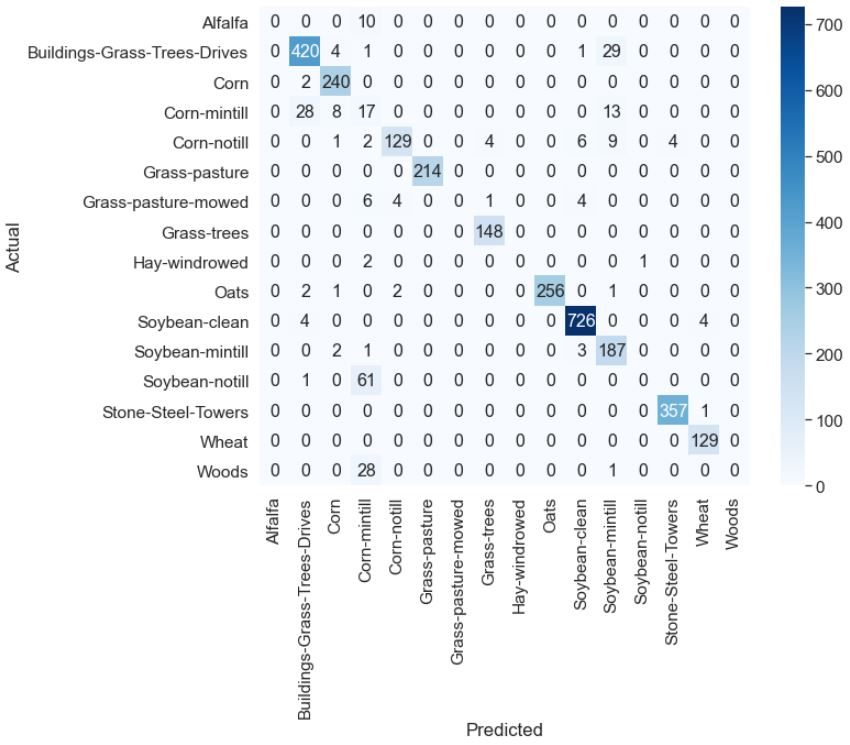
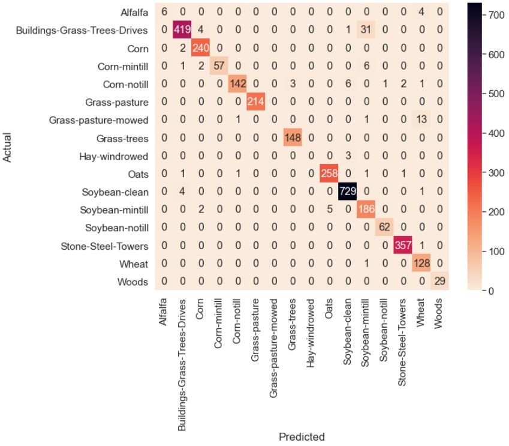
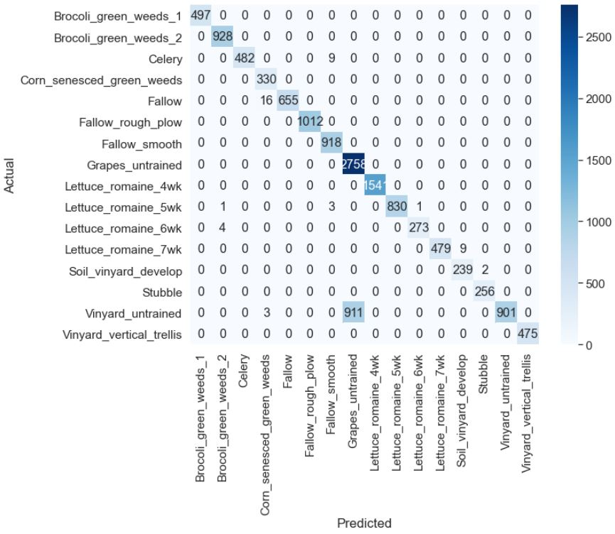
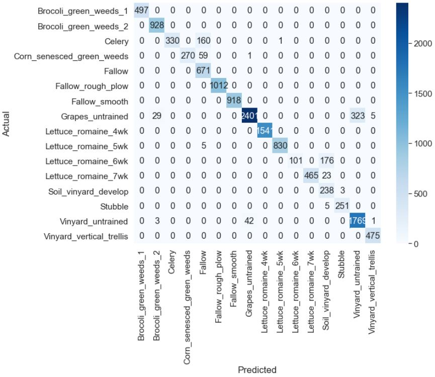
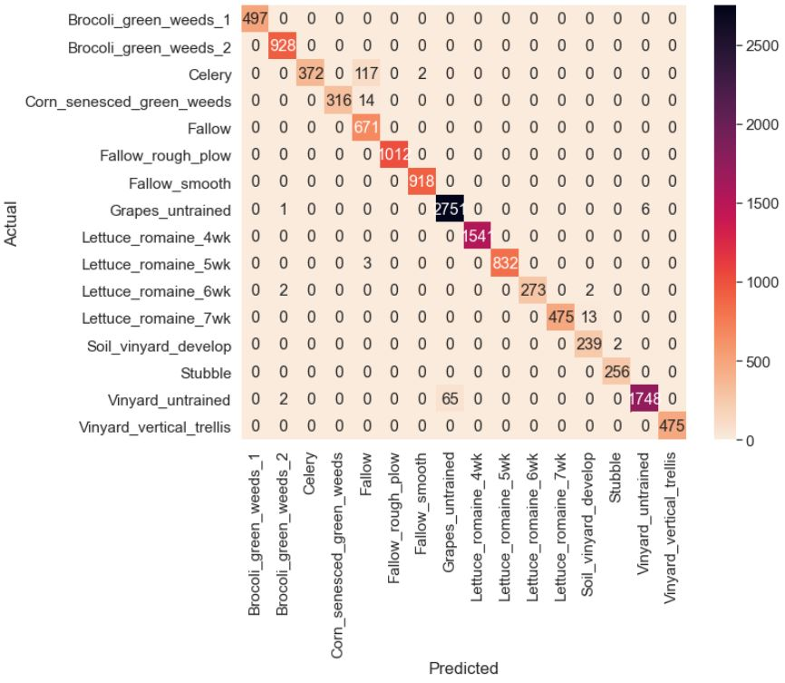
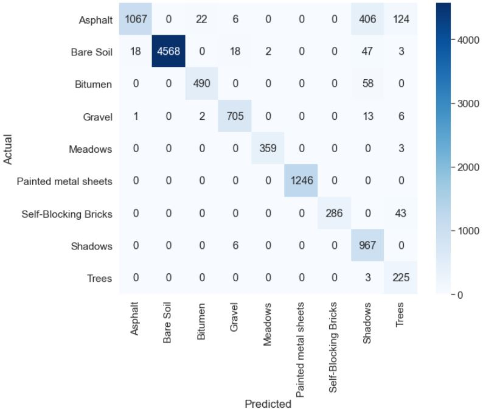
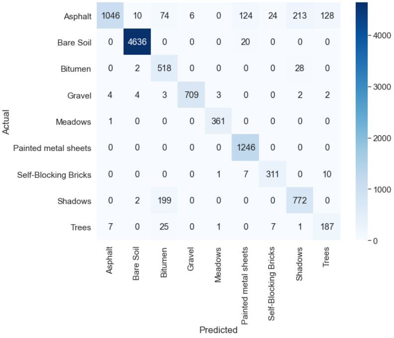
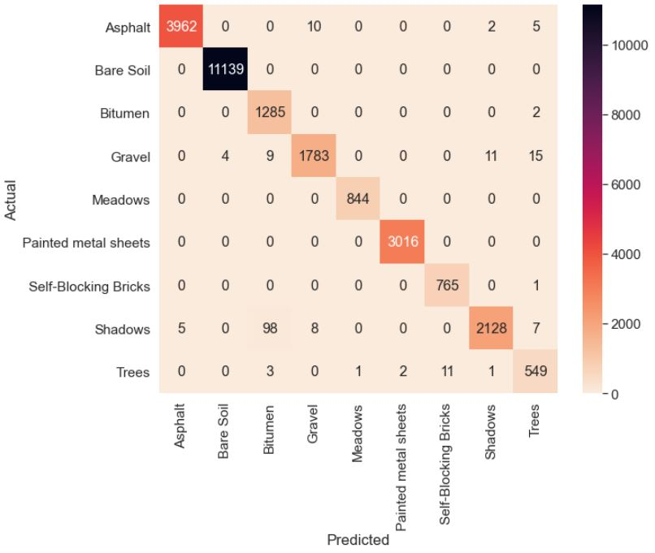

# MDA-HSI - Multi-Dimensional Deep Hierarchical Approach Towards Aerial Hyperspectral Image Classification

## Description 

This paper proposes MDA-HSI, a dual model integrated voting network for hyperspectral image classification. The first model employs a 3D-2D hierarchical structure to provide the spectral spatial joint features along with the abstract level spatial representation of 2D CNNs. The second model is a 3D CNN where the performance increase is provided by incorporating overlapping patches on the original hyperspectral cube to create feature maps over multiple contiguous bands.

## Datasets

## Prerequisites

- [Tensorflow](https://github.com/tensorflow/tensorflow)
- [Keras 2.0](https://github.com/fchollet/keras)
- [Spectral](https://github.com/spectralpython/spectral)
- [OpenCV-Python](https://github.com/opencv/opencv)

## Model Architecture

## Results

## Metrics

  

  

  

## Conclusion

This paper introduces MDA-HIS, a dual multidimensional deep network finetuned for the task of hyperspectral image classification. The main goal of the proposed model is to consider both the spectral and spatial joint representations and interdependencies during the classification process while keeping the computational complexities minimal. We achieve this through two unique approaches. The first approach follows a hierarchical 3D 2D flow where the spectral spatial features are accounted for while an abstract level spatial 2D CNN completes the hierarchy reducing dimensionality. The second approach employs a modified 3D CNN that produces overlapping 3D feature patches over several contiguous bands processed under a three dimensional kernel function to obtain spectral inferences. The overall prediction is made as an weighted ensemble of the two models, which provides a well
defined approach taking all inherent information into consideration for the classification process. The MDA-HSI was tested upon benchmark datasets with existent deep methods which are currently in practice. The MDA-HIS proved efficient both in terms of average accuracy and Kappa score upon evaluation. Future work in this direction can look into the possibilities of self learning ensembles and improving classification strength through data augmentation.
